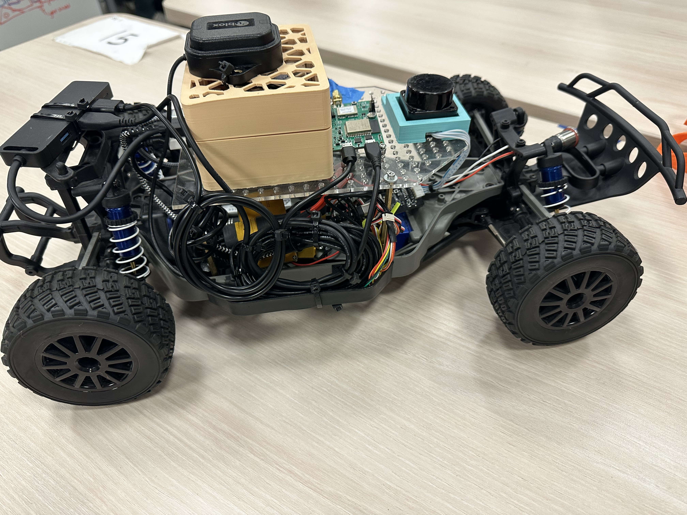

# FA22 ECEMAE 148 Team 1 Final Project: Autonomous Navigation

## About

The goals of this project were to use:

- a GPS and IMU to locate the car's position
- the car's position to download a local map file and execute a path planning route to arrive at a user-defined coordinate
- heading error and cross-track error to adjust steering to ensure the robot stays on path
- LIDAR functionality to detect objects directly in front of the car and stop it

### The Car

The car was equipped with:

- NVIDIA Jetson Nano (in tan housing)
- 360° LIDAR sensory (in light-blue 3D printed housing)
- GPS sensor capable of near-centimeter level precision (mounted on top of jetson case)
- VESC motor and servo controller to drive the car
- IMU sensor (under the blue tape)

## ROS2

The primary launch file used to start full functionality is found in the gps_controller package:

- [full_nav_launch_file.launch.py](gps_controller/launch/full_nav_launch_file.launch.py)

### Packages

#### gps_controller

##### [gps_controller.py](gps_controller/gps_controller/gps_controller.py)

- **subscribes** to the /gps and /imu topics
- **publishes** to the /error topic
- calls the path made in the generate_path.py file
- calculates the cross-track and heading error 

##### [generate_path.py](gps_controller/gps_controller/generate_path.py)

- downloads a local map file based on the car's current position
- plans a path to the user-defined target destination within this map file

#### gps_node

##### [gps_publisher.py](gps_node/gps_node/gps_publisher.py)

- **publishes** to the /gps topic
- Reads the GPS data using RTK
- provides near-cm level precision

#### imu_node

##### [imu_raw_publisher.py](imu_node/imu_node/imu_raw_publisher.py)

- **publishes** to the /imu topic
- Reads the IMU sensor data

#### pid_controller

##### [pid_controller.py](pid_controller/pid_controller/pid_controller.py)

- **subscribes** to the /error topic
- uses a PID controller to determine necessary steering based on heading and cross-track errors
- stops the robot's motion when an object is detected by the LIDAR to be within a given distance
- directly outputs a VESC steering and throttle command

#### ucsd_robocar_sensor2_pkg

- contains necessary launch file [lidar_ld06.launch.py](ucsd_robocar_sensor2_pkg/launch/lidar_ld06.launch.py) to use lidar
  - the file is accessed by the [full_nav_launch_file.launch.py](gps_controller/launch/gps_controller_launch_file.launch.py) launch file

### Topics

#### /error

- Publishers:
  - [gps_controller.py](gps_controller/gps_controller/gps_controller.py)
- Subscribers:
  - [pid_controller.py](pid_controller/pid_controller/pid_controller.py)

#### /imu

- Publishers:
  - [imu_raw_publisher.py](imu_node/imu_node/imu_raw_publisher.py)
- Subscribers:
  - [gps_controller.py](gps_controller/gps_controller/gps_controller.py)

#### /gps

- Publishers:
  - [gps_publisher.py](gps_node/gps_node/gps_publisher.py)
- Subscribers:
  - [gps_controller.py](gps_controller/gps_controller/gps_controller.py)
